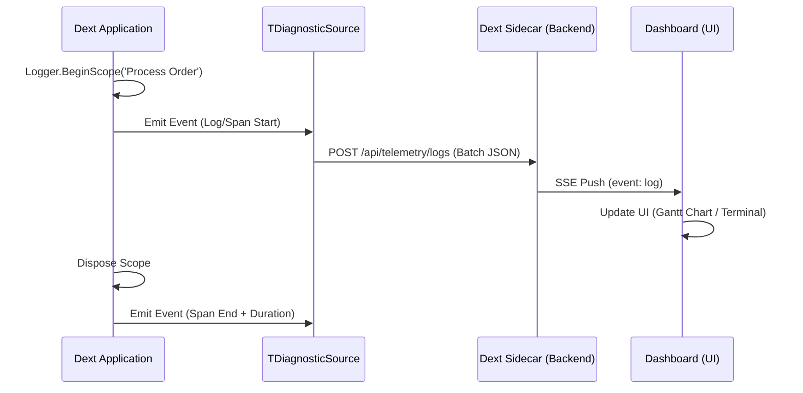

# Specification: S24 — Live Logging & Tracing (Observability Suite)

Esta especificação detalha a implementação do sistema de Observabilidade "ponta a ponta" no Dext Sidecar, unificando Logs e Traces em uma interface rica estilo **DataDog/CodeSite**.

## 1. Visão Geral do Fluxo de Dados


## 2. Especificação do Payload (JSON)
Cada entrada de telemetria deve seguir este esquema padronizado:

```json
{
  "type": "log | span_start | span_end",
  "level": "Trace | Debug | Info | Warning | Error | Critical",
  "category": "SQL | HTTP | APP | SYS",
  "message": "Message content or Span name",
  "timestamp": "ISO8601",
  "traceId": "UUID",
  "spanId": "UUID",
  "parentId": "UUID (optional)",
  "durationMs": 123,
  "metadata": {
    "sql": "SELECT...",
    "http_method": "POST",
    "user_id": "user_123"
  }
}
```

## 3. UI: O "Observability Hub"
A interface será dividida em três visualizações principais:

### A. Live Stream (The "Terminal")
*   **Aparência:** Estilo terminal moderno (monospaced) com cores por severidade.
*   **Funcionalidades:**
    *   Filtro "Search-as-you-type" no conteúdo.
    *   Toggle para níveis de log (Ex: Ver apenas 'Error' e 'Warning').
    *   Agrupamento por Category.
*   **Diferencial Dext:** Ao clicar em um log, expandir um "Context Drawer" com o JSON completo do `metadata`.

### B. Trace Explorer (The "Gantt Chart")
*   **Aparência:** Inspirada no DataDog APM.
*   **Hierarquia:** Mostrar Spans aninhados. Se um `BeginScope` abriu um Span e dentro dele houve 5 Queries SQL, as queries aparecem indentadas sob o Span pai.
*   **Timings:** Barra visual de duração para cada Span.

### C. Object Inspector (The "CodeSite Mode")
*   **Aparência:** Tree view interativo de objetos JSON.
*   **Trigger:** Logs que enviem `TObject` via `BeginScope` ou `Log`.

## 4. Próximos Passos Técnicos

### Backend (Framework)
1.  Atualizar `TTelemetryEvent` em `Dext.Logging.Telemetry.pas` para incluir `TraceId` e `SpanId`.
2.  Implementar `TSpanDisposable` que emite o evento `span_end` ao ser destruído.
3.  Auto-instrumentar middlewares (HTTP) e DB Connection (SQL) para abrir Spans automaticamente.

### Sidecar (Backend)
1.  Garantir que o bridge em `Dext.Dashboard.Routes.pas` não mutile o JSON original, apenas repasse para o `IEventStreamer`.

### Dashboard (UI)
1.  Criar `ObservabilityView.vue` (ou fragmento HTMX) com suporte a virtual scrolling (para performance com milhares de logs).
2.  Implementar o motor de filtros reativo em JS.

---
**Meta:** Proporcionar ao desenvolvedor Delphi a mesma visibilidade de um ecossistema Cloud-Native moderno.
